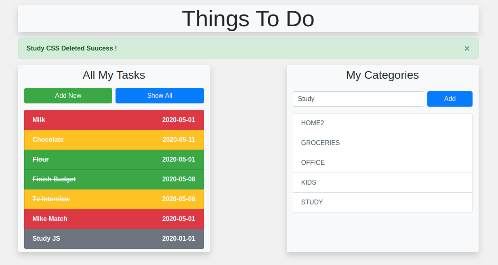
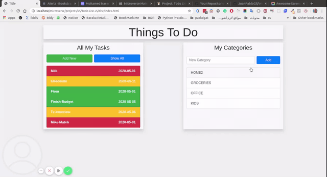

# Todo-List-JS

A Simple Todolist with html and js .

[Click To Check The Project Details](https://www.theodinproject.com/courses/javascript/lessons/todo-list)

## Authors

This project was executed by the duo of :

- [Mohamed Naser](https://www.linkedin.com/in/mohamednaseramein/)
- [Salvador Olvera](https://www.linkedin.com/in/salvador-olvera-n)

## Used Tools

- HTML
- CSS
- JavaScript
- LocalStorage
- MarkDown Syntax

## Done Work

- [x] Build Static Html.
- [X] Build Program Logic.
- [X] Create New Projects.
- [X] Validate New Task Data. 
- [X] Create New Tasks For Project.
- [X] Update Task Complete Status.
- [X] Remove Task.
- [X] Update Task.

## Setup

Open your git bash and cd to the location you'd like to put your files the run the command below.

```console
git clone https://github.com/mohamednaser/restaurant.git
```

## Live Version

Live version [here](https://mohamednaser.github.io/restaurant/).

## ScreenShots



